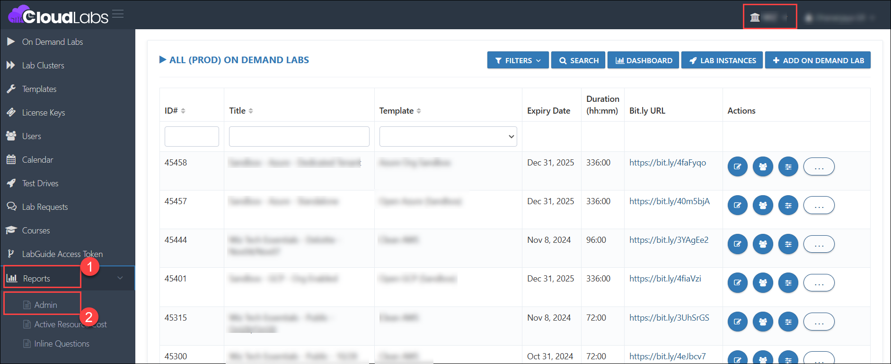
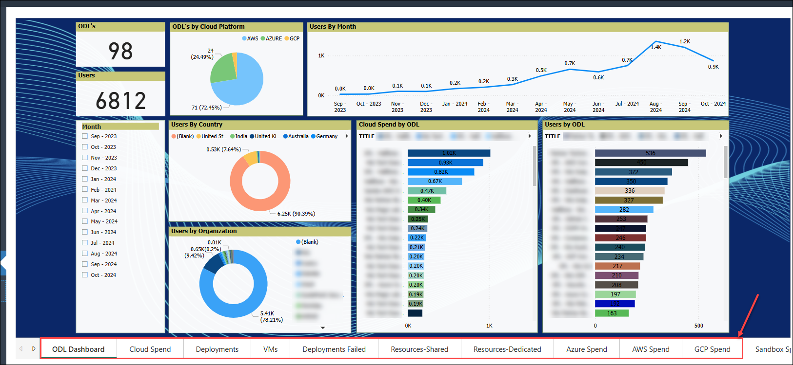

# Accessing Power BI

### Overview

Power BI is a business analytics tool that helps visualize and share insights from your data through interactive reports and dashboards, allowing admins to view various fields across multiple sections. You can explore a variety of configurations in Power BI, such as deployments, cloud spend, VMs, deployents failed and much more.

In this section, we will learn how to access Power BI from the CloudLabs tenant.

### Prerequisites

Before accessing Power BI in CloudLabs, ensure you have the following prerequisites:

1. Admin access to [CloudLabs Admin Portal](https://admin.cloudlabs.ai/) (If access is unavailable, kindly reach out to your point of contact or [CloudLabs Support](https://docs.cloudlabs.ai/RequestSupport)).

### Accessing Power BI

1. Log in to the CL portal and navigate to the required tenant. On the left-hand side of the page, you will see the Power BI section.

2. Navigate to the **Power BI (1)** section that is available in the left menu and click on the **ADMIN (2)** button given in the bottom left corner.

   

3. Now you will be able to see multiple sections of reports.

   

  >**Note:** We can customize the reports section as needed.
